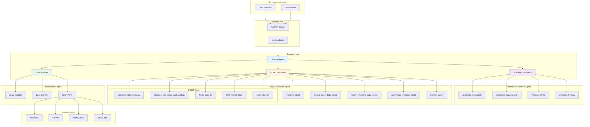

# Backend

This is the backend for the GDG Solution Hacks project, featuring a unified environment with multiple specialized AI agents.

## 🏗️ Agent Architecture



## Project Structure

```
backend/
├── agents/                 # All AI agents (organized)
│   ├── academic-research/  # Academic research agent
│   ├── fomc-research/      # FOMC financial analysis agent
│   ├── political-news/     # Political news agent
│   └── routing_agent/      # Main routing agent
├── api/                    # API endpoints and schemas
├── database/               # Database models and schemas
├── managers/               # Business logic managers
├── storage/                # File storage utilities
├── .venv/                  # Unified virtual environment
├── requirements.txt        # All dependencies
├── app.py                  # Main FastAPI application
└── README.md              # This file
```

## Quick Start

1. **Activate the virtual environment:**
   ```powershell
   cd backend
   .\.venv\Scripts\Activate.ps1
   ```

2. **Run the routing agent (recommended):**
   ```powershell
   cd agents/routing_agent
   adk run routing_agent
   ```

3. **Or run the main application:**
   ```powershell
   python app.py
   ```

## Agents

All agents are located in the `agents/` directory and are designed to work together:

- **Routing Agent**: Routes user requests to appropriate specialized agents
- **Academic Research Agent**: Analyzes academic papers and provides research advice
- **FOMC Research Agent**: Analyzes Federal Reserve meetings and financial data
- **Political News Agent**: Scrapes and analyzes political news

See `agents/README.md` for detailed information about each agent.

## Environment Setup

The project uses a unified virtual environment with all dependencies managed in `requirements.txt`. No need for separate environments per agent.

## Dependencies

All dependencies are listed in `requirements.txt` and include:
- Google ADK for agent development
- FastAPI for web services
- Various specialized libraries for each agent's functionality

## Development

To add new dependencies:
```powershell
pip install <package>
pip freeze > requirements.txt
```

To run tests:
```powershell
cd agents/routing_agent
python test_connection.py
```
